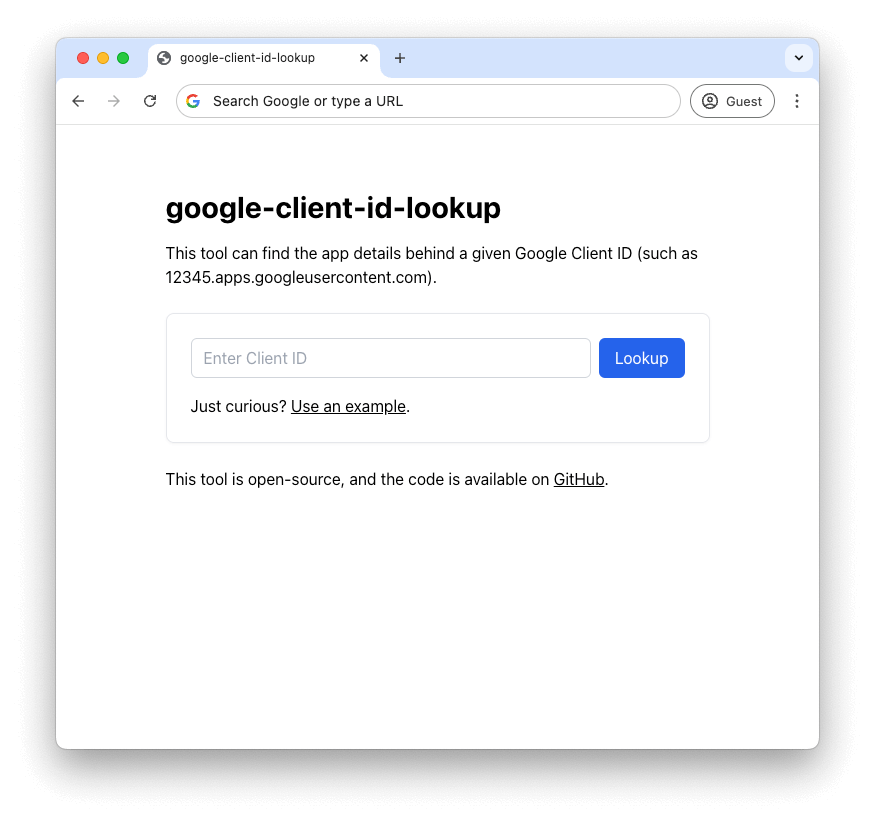
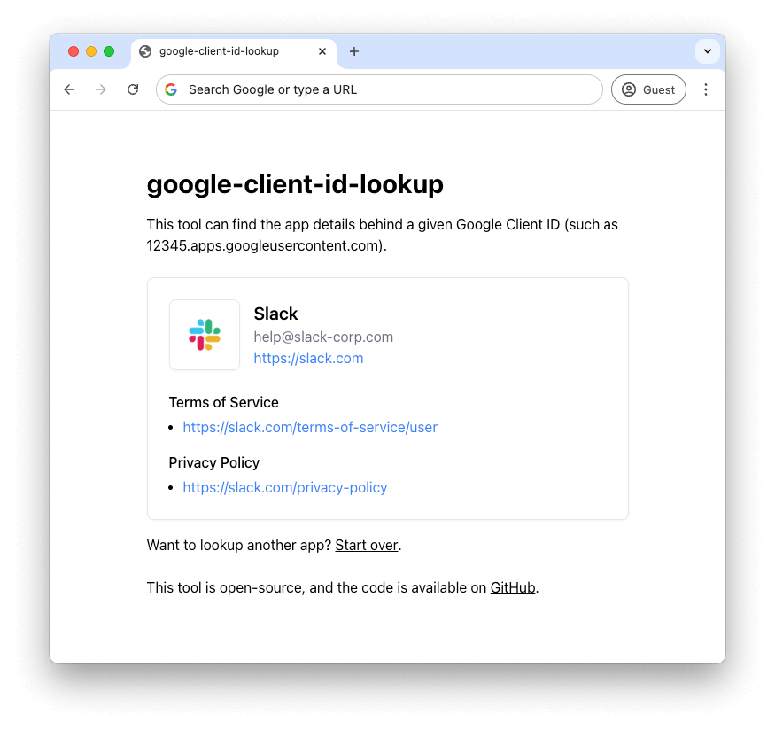

# google-client-id-lookup [(view live)](https://adamjones.me/google-client-id-lookup/)

Web app that can find the app behind a given Google Client ID (such as 12345.apps.googleusercontent.com)

| Home Page | Results Page |
|------------|--------------|
|  |  |

## How it works

The Google OAuth error pages provide hidden data about the app when provided a client ID for debugging purposes. This app fetches those pages, scrapes the data and displays the app information in a nice way.

This might be broken by changes Google makes to their OAuth sign-in pages.

## Contributing

Pull requests are welcomed on GitHub! To get started:

1. Install Git and Node.js
2. Clone the repository
3. Install dependencies with `npm install`
4. Run the app with `npm start`
5. Run `npm run test` to run tests
6. Build with `npm run build`

## Releases

Commits to the master branch are automatically published to GitHub Pages.
