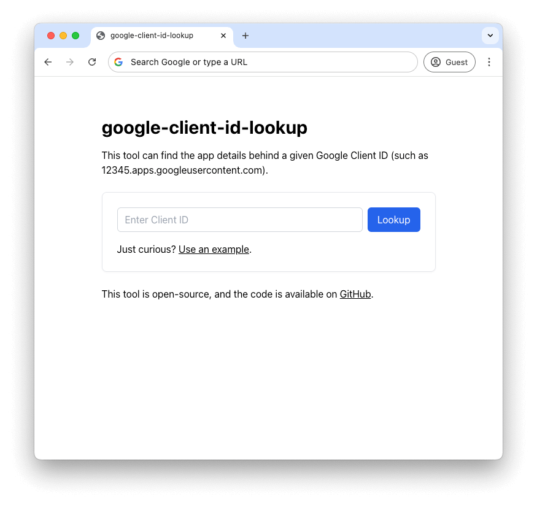
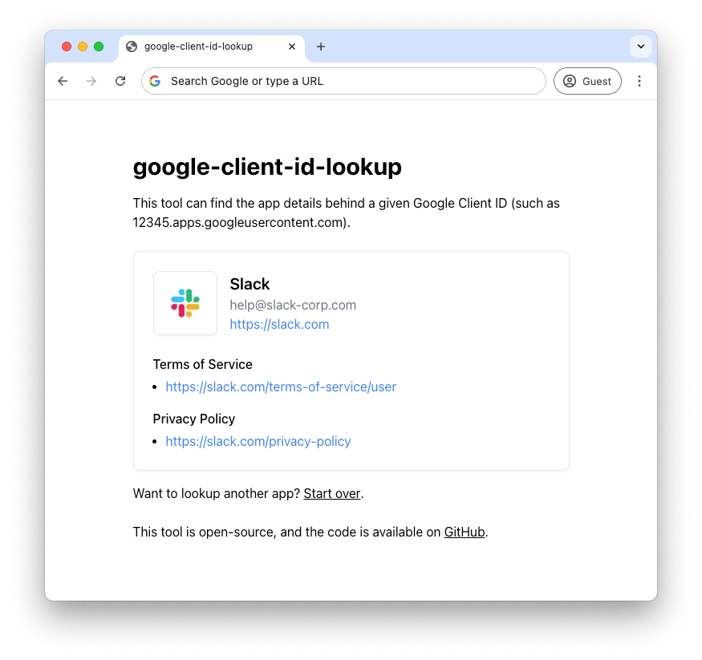

# google-client-id-lookup [(view live)](https://adamjones.me/google-client-id-lookup/)

Web app that can find the app behind a given Google Client ID (such as 12345.apps.googleusercontent.com)

| Home Page | Results Page |
|------------|--------------|
|  |  |

## How it works

Google's OAuth error page (`https://accounts.google.com/signin/oauth/error?client_id=...&flowName=GeneralOAuthFlow`) embeds details about the app — name, logo, support email, terms of service and privacy policy URLs — in `AF_initDataCallback` script chunks. This app fetches that page, scrapes the data and displays it in a nice way.

**⚠️ Current status:** in-browser lookup is unreliable. Google only serves the page with app details to requests with a browser-like `User-Agent`, and rejects (403) requests carrying `Sec-Fetch-Site: cross-site` — a header browsers force-attach to cross-site fetches and JavaScript cannot remove. Public pass-through CORS proxies forward that header, so they generally fail. When the lookup fails, the site shows a curl + jq command that gets the same details.

**To fix this properly**, the lookup would need to go via a server we control that makes its own clean request to Google (e.g. a small serverless proxy that sets a browser-like `User-Agent` and drops the browser's `Sec-Fetch-*` headers).

This tool is subject to breaking changes whenever Google updates their OAuth sign-in pages.

## Contributing

Pull requests are welcomed on GitHub! To get started:

1. Install Git and Node.js
2. Clone the repository
3. Install dependencies with `npm install`
4. Run the app with `npm start`
5. Run `npm run test` to run tests
6. Build with `npm run build`

## Releases

Commits to the master branch are automatically published to GitHub Pages.
